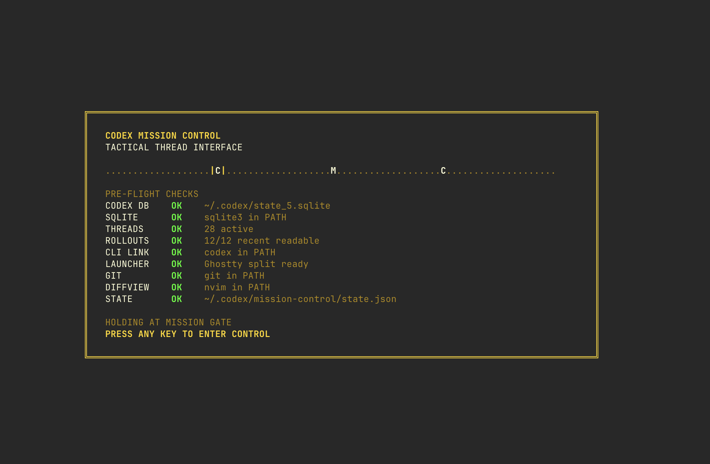

# Codex Mission Control

<p align="center">
  
</p>

A command-center TUI for watching local Codex Desktop/CLI threads.

It reads the same local artifacts as `codex-live`:

- `~/.codex/state_5.sqlite`
- `~/.codex/sessions/**/rollout-*.jsonl`

The TUI is file-backed, so it does not depend on the experimental app-server
control socket being present. Local control actions use the public Codex CLI,
starting with `codex resume <thread-id>`. The iOS bridge uses a persistent
headless `codex app-server` process for prompts sent from the phone.

## Run

Install:

```sh
go install github.com/parthsareen/codex-mission-control/cmd/cmc@v0.1.4
```

```sh
go run ./cmd/cmc
```

Build:

```sh
go build -o ./cmc ./cmd/cmc
./cmc
```

Static render for quick checks:

```sh
go run ./cmd/cmc --snapshot
```

## Keys

```text
j/k, up/down   move through threads
tab            switch between thread list and fleet/comms pane
1-9, 0         jump to fleet callsign, with 0 selecting the tenth row
c              open comms for selected thread
d              open nvim DiffviewOpen in the selected thread cwd
n              create a new mission: pick/create cwd, branch/review optional, launch codex
/              search chats/folders/worktrees
enter          open comms for selected thread
o              fleet overview
pgup/pgdn      scroll comms history
ctrl+u/d       scroll comms history
[/]            scroll comms history
l              snap back to live/latest
v              visual-select comms lines
y              copy selected/current comms lines
r              launch codex resume <id> in Ghostty split/window
R or a         ask, then launch codex resume with that prompt
t              cycle theme
space          pause/resume live updates
esc            leave focus or cancel prompt
q              quit
```

Themes: green, cyan, amber, blue, purple, red, white.

Mission Control remembers the last theme, selected thread, pane, comms
position, intro splash preference, and seen final timestamps in
`~/.codex/mission-control/state.json`. Set `"intro_splash": false` there to
skip the startup splash. When enabled, the splash stays up until you press a
key.

The startup splash runs quick pre-flight checks for Codex data, SQLite, recent
rollout files, the Codex CLI, detached terminal launch support, Git, nvim
Diffview, and Mission Control state persistence. Green is ready, yellow is
non-blocking degraded mode, and red means a required system failed.

Escalation requests, such as tool calls with
`sandbox_permissions: "require_escalated"`, render as `ALERT`. Threads with a
fresh final answer that you have not selected render as red `REVIEW` until
opened.

Launches prefer Ghostty on macOS. If Mission Control is already running inside
Ghostty, `r` opens a right split with the selected thread's cwd and `codex
resume`; otherwise it opens a new Ghostty window. Ghostty launches use a surface
configuration with the thread cwd and initial shell input so your normal shell
and Ghostty integration stay in play. Tmux is used as a fallback when Ghostty
scripting is unavailable inside a tmux session.

## iOS companion

The `ios/CodexSessionControl` project is a small SwiftUI app for selecting an
existing thread, watching its latest rollout events, and sending a prompt from
an iPhone or simulator. It talks to the Mac-side bridge:

```sh
go run ./cmd/cmc-bridge
```

Use Tailscale for a physical device:

```sh
go run ./cmd/cmc-bridge --tailscale
```

The bridge binds only to the Mac's Tailscale IPv4 address and prints the exact
URL to enter in the iOS app.

On the thread detail screen, the app polls the bridge every 5 seconds for the
latest messages/events. You can send a prompt or command into the selected
thread through the bridge's persistent headless `codex app-server`, and
optionally override model plus reasoning speed for that turn.

The app can also start a new chat. The bridge exposes a project picker rooted
at `~/Documents/repos`, validates that the chosen directory stays under that
root, then starts the new thread in the selected project. For git projects, the
new-chat flow can use the selected folder, switch to an existing worktree, or
create a new worktree from a selected branch before starting Codex. Use
`--projects-root <path>` if your repo directory lives somewhere else.
